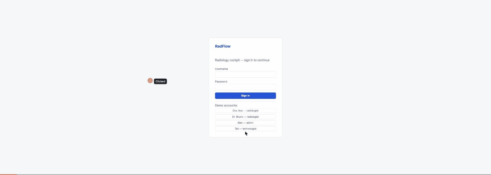

# RadFlow

**AI-powered radiology worklist & dictation cockpit** — a unified workspace where radiologists
manage their reading queue, view DICOM studies, dictate reports, and let AI draft the structured
report — integrated with clinical systems via HL7 and DICOM.

**Cockpit de worklist e ditado radiológico com IA** — um espaço único onde radiologistas
gerenciam a fila de leitura, visualizam estudos DICOM, ditam laudos e deixam a IA estruturar o
rascunho — integrado a sistemas clínicos via HL7 e DICOM.

> ⚠️ **Demo project / Projeto de demonstração.** Synthetic patients and generated DICOM only.
> **No real PHI, ever.** / Somente pacientes sintéticos e DICOM gerado. **Nenhum PHI real.**



## Architecture / Arquitetura

```
                    React/Vite cockpit ── worklist · dictation · admin KPIs
                          │ HTTPS + WebSocket (JWT)
                    api-gateway (NestJS) ── auth · RBAC · audit de 403 · WS fan-out
                          │ HTTP (X-User-*, traceparent)
        ┌─────────────────┼──────────────────────┬─────────────────┐
   worklist-svc      integration-svc        dictation-svc     report-ai-svc
   (NestJS + PG)     (NestJS)               (NestJS + PG)     (Python/FastAPI)
   fila · SLA        HL7 ORM in (MLLP)      laudo draft→      LLM draft · achados
   claim/sign        ORU out · Orthanc      signed · saga     críticos · eval harness
   audit · stats     bridge · DICOM synth   c/ worklist       (Anthropic/OpenAI/stub)
        └────────────── NATS JetStream (outbox → relay → durable consumers → DLQ) ──┘

   PostgreSQL (DB por serviço) · Orthanc + OHIF (PACS/viewer) · OTel → Jaeger · Prometheus → Grafana
```

Key patterns / Padrões centrais: rich domain aggregates (DDD tático), transactional outbox,
optimistic locking, durable consumers with DLQ, append-only audit log (DB trigger), JWT + RBAC
at the gateway, LLM eval harness with CI gate. Decisions are recorded in [`specs/`](specs/)
(ADRs 0001–0009).

## Stack

NestJS/TypeScript · React 19 + Vite · PostgreSQL 16 · NATS JetStream · Python 3.12/FastAPI ·
Docker Compose · OpenTelemetry + Jaeger · Prometheus + Grafana · Orthanc + OHIF

## Getting started

```bash
# full stack (13 containers)
docker compose up -d --build

# optional: real AI drafts (otherwise a deterministic stub is used)
AI_PROVIDER=anthropic ANTHROPIC_API_KEY=sk-... docker compose up -d report-ai
```

| Surface | URL | Credentials |
|---|---|---|
| Cockpit (web) | http://localhost:5173 | `ana`/`ana` (radiologist) · `admin`/`admin` · `tech`/`tech` |
| API gateway | http://localhost:3010/api/v1 | JWT via `POST /auth/login` |
| Orthanc + OHIF | http://localhost:8042 | — |
| Jaeger (traces) | http://localhost:16686 | — |
| Grafana (dashboards RadFlow) | http://localhost:3300 | `admin`/`admin` |
| Prometheus | http://localhost:9091 | — |

Feed it with synthetic HL7 orders (each one becomes a study + DICOM images in Orthanc):

```bash
pnpm --filter @radflow/integration run feeder -- --rate 20 --duration 60
```

## Development

```bash
pnpm install
pnpm run build:packages   # shared → messaging → ddd → telemetry
pnpm run typecheck
pnpm test                 # unit + integration (integration uses Testcontainers: PG, NATS, Orthanc)
pnpm -r run test:e2e      # service-level e2e
```

Python service:

```bash
cd services/report-ai
uv sync
PYTHONPATH=src AI_PROVIDER=stub uv run pytest
PYTHONPATH=src AI_PROVIDER=stub uv run python -m report_ai.eval   # LLM eval harness (CI gate)
```

Engineering rules live in [`AGENTS.md`](AGENTS.md). Tests are split into `.spec.ts`
(unit), `.int-spec.ts` (Testcontainers) and `.e2e-spec.ts`.

## Compliance story / Narrativa de conformidade

- Append-only audit log per service — a database trigger rejects `UPDATE`/`DELETE`;
  every write use case records who/what/when/origin in the same transaction.
- Denied write attempts (403 at the gateway) are audited too.
- RBAC per route: `technologist` feeds orders, `radiologist` claims/dictates/signs,
  `admin` reads audit trails and KPIs.
- Zero PHI: synthetic patients, generated DICOM, no audio ever leaves the browser
  (Web Speech API — see ADR 0006).
